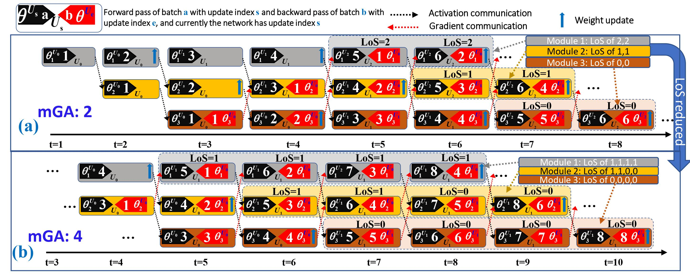

# Accumulated-Decoupled-Learning
This repository will contain the codes for the paper "Accumulated Decoupled Learning with Gradient Staleness Mitigation for Convolutional Neural Networks" accepted in ICML 2021. **The codes will be available very soon.**

